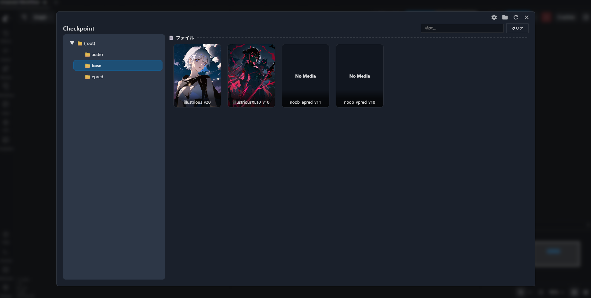
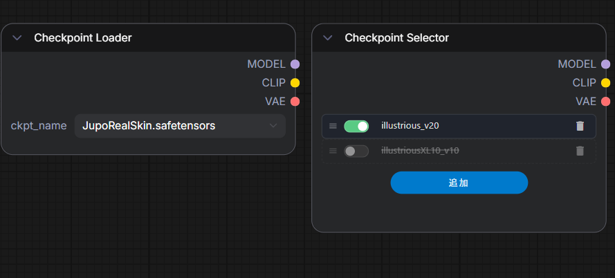
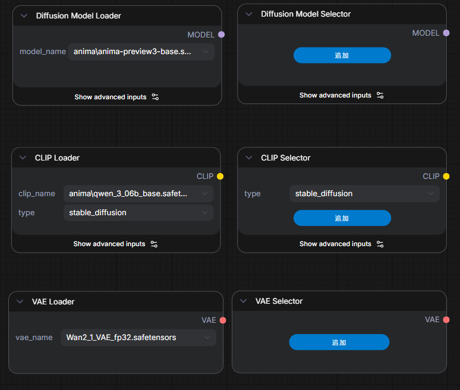
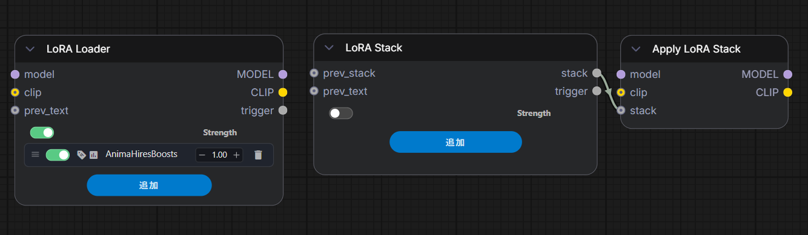
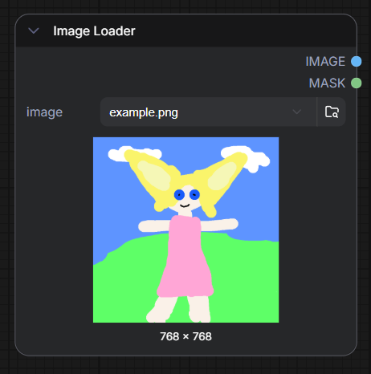
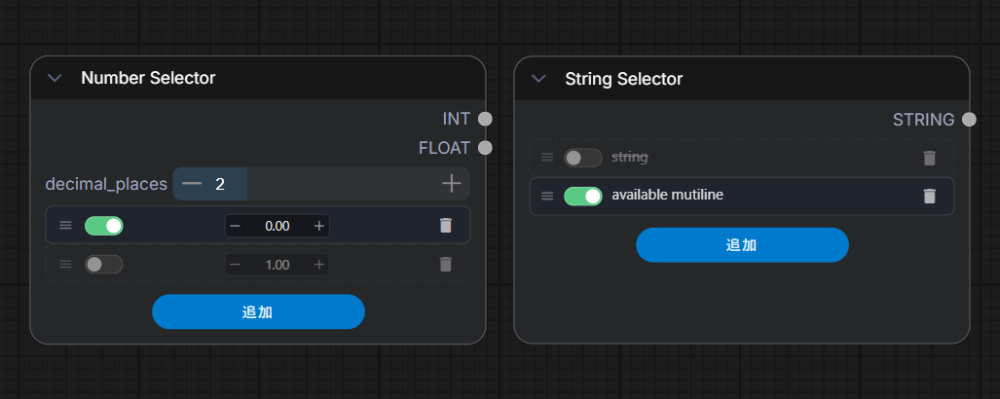
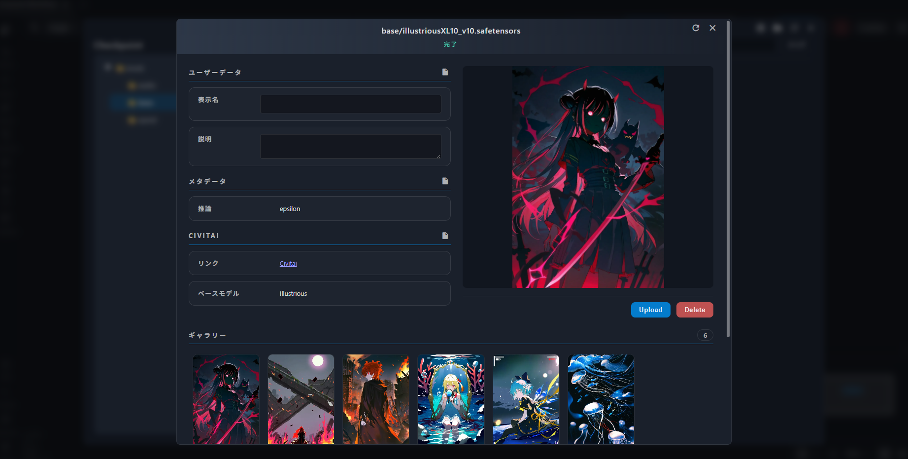

# Comfy Jupo Loader

Comfy Jupo Loader は、ComfyUI のモデル・画像・プリミティブ値の選択を扱いやすくするためのカスタムノード集です。独自エクスプローラ、モデル情報ダイアログ、ギャラリー、Loader/Selector ノード、Nodes 2.0 対応 UI を提供します。



## 主な機能

- Checkpoint、LoRA、Diffusion Model、CLIP、VAE、入力画像に対応した独自エクスプローラ
- 表示名、説明、メタデータ、Civitai/CivArchive 情報、プレビュー、ギャラリーを扱えるモデル情報ダイアログ
- 標準のファイル選択メニューではなく独自エクスプローラを開く Loader ノード
- 複数候補を保持して有効な1件を選べる Selector ノード
- Nodes 2.0 での hidden values とファイル選択 UI の挙動に対応
- プレビュー付き Image Loader
- ディレクトリ内画像を1枚ずつ自動ジョブ展開する Directory Image Loader
- 数値と複数行文字列の Primitive Selector

## インストール

このリポジトリを `ComfyUI/custom_nodes` に配置してください。

```bash
cd ComfyUI/custom_nodes
git clone https://github.com/jupo-ai/comfy-jupo-loader.git
```

追加依存関係をインストールします。

```bash
pip install -r comfy-jupo-loader/requirements.txt
```

ComfyUI 標準の `requirements.txt` はインストール済みである前提です。このパッケージの `requirements.txt` には、追加で必要なものだけを記載しています。

## ノード

### Model



#### Checkpoint

- `Checkpoint Loader`
- `Checkpoint Selector`

どちらも `MODEL`、`CLIP`、`VAE` を出力します。Loader は単一のファイルを選択し、Selector は複数の候補を保持して有効な1件を選択できます。



#### Diffusion Model

- `Diffusion Model Loader`
- `Diffusion Model Selector`

`models/diffusion_models` のファイルを読み込みます。ComfyUI 標準の diffusion model loader と同じ weight dtype 設定に対応しています。

#### CLIP

- `CLIP Loader`
- `CLIP Selector`
- `Dual CLIP Loader`
- `Dual CLIP Selector`
- `Triple CLIP Loader`
- `Triple CLIP Selector`
- `Quadruple CLIP Loader`
- `Quadruple CLIP Selector`

`models/text_encoders` のファイルを読み込みます。Dual CLIP は type 設定に対応し、Triple / Quadruple CLIP は SD3 や HiDream などの構成で使うことを想定しています。

#### VAE

- `VAE Loader`
- `VAE Selector`

`models/vae` のファイルを読み込みます。

#### LoRA



- `LoRA Stack`
- `Apply LoRA Stack`
- `LoRA Loader`

LoRA の複数候補、model/clip strength、トリガーワード出力、LBW 設定に対応しています。

Schedule 機能には重大な不具合があるため、現在 Schedule UI は一時的に非表示にしています。

### Image



#### Image Loader

`Image Loader` は ComfyUI の input フォルダとそのサブフォルダ内の画像を読み込みます。旧 UI と Nodes 2.0 のどちらでも独自エクスプローラを開きます。サブフォルダ内画像でも MaskEditor が扱えるように、画像パスの正規化も行います。

#### Directory Image Loader

`Directory Image Loader` は、指定したディレクトリ内の画像を対象に、1回の Queue 操作で画像枚数ぶんのジョブを自動展開する画像読み込みノードです。

入力は以下です。

- `directory`: 読み込む画像ディレクトリ
- `extensions`: 対象にする画像拡張子。例: `png,jpg,jpeg,webp`
- `include_subdirectories`: サブディレクトリ内の画像も対象にするか

出力は以下です。

- `image`
- `mask`

ノード上の `Select Directory` ボタンから Windows 標準のフォルダ選択ダイアログを開き、選択したディレクトリを `directory` に反映できます。ノードには対象画像数も `Images: 12` のように表示されます。

Queue 時には web 拡張が対象画像数を取得し、内部の `index` を `0, 1, 2...` と差し替えたプロンプトを自動投入します。通常は ComfyUI の `Batch count` を `1` にして使ってください。`Batch count` を増やすと、画像枚数に対してさらにその回数ぶん投入されます。

### Primitive



#### Number Selector

`Number Selector` は複数の数値候補を保持し、そのうち有効な1件を `INT` と `FLOAT` として出力します。

- 数値欄をドラッグして値を調整
- 数値欄をクリックして直接入力
- `decimal_places` で小数点以下の表示桁数と丸め精度を設定

#### String Selector

`String Selector` は複数行入力に対応した文字列 Selector です。1行だけ入力すれば通常の String Selector として使えます。複数候補のうち、有効な1件を `STRING` として出力します。

## エクスプローラとモデル情報



モデル項目を右クリックするか、エクスプローラ上の情報アイコンからモデル情報ダイアログを開けます。

モデル情報ダイアログでは、表示名や説明の保存、メタデータの確認、Civitai/CivArchive 情報の取得、プレビュー画像やギャラリー画像の管理ができます。

独自エクスプローラでは以下を扱えます。

- ディレクトリツリーでの移動
- 検索
- サムネイル表示
- 保存済み表示名の反映
- 現在のディレクトリを開く
- ファイル一覧の更新

## Requirements

追加で必要な依存関係のみを `requirements.txt` に記載しています。

```txt
aiofiles
```

`aiohttp`、`numpy`、`Pillow`、`torch`、`tqdm`、`blake3` など、ComfyUI 標準の `requirements.txt` に含まれるものは重複して記載していません。
